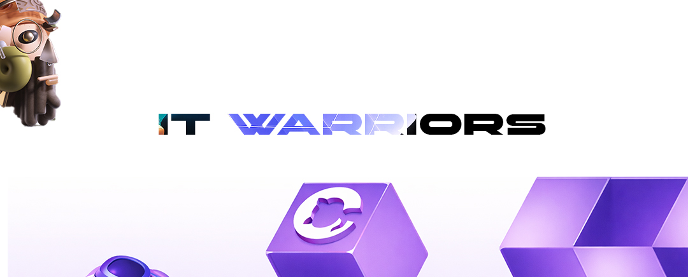

<!-- Сгенерировано EyeCode Dashboard -->

> **Группа:** Group B

### Состав группы
| ID | ФИО | Статус |
|----|-----|--------|
| #FD-241101-015 |  Сергей Арутюнян | active |
| #FD-240701-010 | Мухаммед Намазов | active |
| #FD-241101-016 | Александр Штейнле | active |
| #FD-240701-009 | Арон Гаврилов | active |
| #FD-241101-014 | Андрей Дубов | active |

---

# Задание: Пиксель-арт флаг на Canvas
## Суть задания

Ты нарисуешь **флаг любой страны** на HTML Canvas, используя **только прямоугольники**. Никаких картинок — только код и цвета.

Выбери страну сам. Чем интереснее флаг — тем интереснее задание.

---

## 📋 Пошаговый план

### 1️⃣ Создай HTML-страницу

Добавь элемент `<canvas>` на страницу. Задай ему ширину **600** и высоту **400**. Подключи отдельный файл `flag.js`.

---

### 2️⃣ Получи контекст

В `flag.js` найди canvas по `id` и получи 2D-контекст через `getContext('2d')`. Это твой "карандаш" для рисования.

---

### 3️⃣ Выбери флаг и изучи его

Посмотри на флаг выбранной страны и ответь себе на вопросы:

- Сколько цветных блоков или полос?
- Они горизонтальные, вертикальные или смешанные?
- Есть ли элементы в центре?

Нарисуй схему на бумаге — где какой прямоугольник, какого размера и цвета.

---

### 4️⃣ Нарисуй флаг

Каждый блок флага — это один вызов `fillRect`. Перед каждым блоком задавай нужный цвет через `fillStyle`.

> 💡 `fillRect` принимает 4 аргумента: **x, y, ширина, высота**. Точка (0, 0) — это левый верхний угол canvas.

Рисуй блоки **по очереди**, сверху вниз или слева направо — в зависимости от флага.

---

### 5️⃣ Добавь рамку

После того как флаг готов, обведи весь canvas тонкой тёмной рамкой. Используй `strokeRect` и задай цвет через `strokeStyle`.

---

### 6️⃣ Подпиши флаг

Под флагом выведи название страны текстом. Используй `fillText` — задай шрифт через `font` и цвет через `fillStyle`.

---

  <h2>👁️ Чеклист перед сдачей</h2>

| Проверка | Статус |
|----------|--------|
| Флаг узнаваем и похож на оригинал | ☐ |
| Использован только `fillRect` для рисования | ☐ |
| Цвета соответствуют настоящему флагу | ☐ |
| Есть рамка вокруг флага | ☐ |
| Есть подпись с названием страны | ☐ |
| Ни одного `` в коде | ☐ |
| README.md заполнен | ☐ |

 <h2>📤 Как сдать</h2>

| Способ | Что делать |
|--------|------------|
| **ZIP** | Упакуй папку с `index.html` и `flag.js` |

> ⏳ **Дедлайн:** 14 дней с момента получения задания

### 🎓 Удачи в разработке!
**Вопросы?** Пиши в чат курса
[www.eyecodeuniversity.ru](https://www.eyecodeuniversity.ru)

